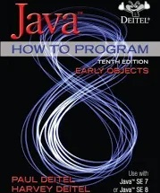

# Java How to Program Early Objects 10th Edition Exercises
Exercises found in the textbook by Paul Deitel & Harvey Deitel.

Skips Chapter 1 since it doesn't have coding exercises.

## Chapters
- Chapter 2: Introduction to Java Applications; Input/Output and Operators
- Chapter 3: Introduction to Classes, Objects, Methods, and Strings